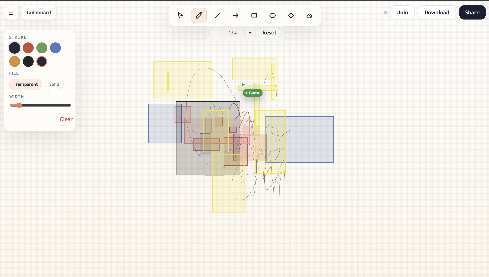

# Colaboard



Colaboard is a collaborative whiteboard application inspired by Excalidraw. It provides a full-screen drawing surface, live multi-user collaboration over WebSockets, room-based sharing, and Redis-backed whiteboard state replay.

This repository contains multiple projects, but the active whiteboard stack is:

- Frontend: `client`
- Backend: `spring-backend`
- Redis compose file: `docker-compose.redis.yml`

The `server` directory contains an older Node.js Socket.IO implementation and is not the active backend for the current app. The `code-judge` directory is a separate project and is unrelated to the whiteboard.

## Features

- Real-time collaboration with room-based sessions
- Freehand drawing and shape tools
- Shareable room links
- Remote cursors and participant count
- Zoom, pan, clear board, and PNG export
- Redis-backed room history and pub/sub fanout
- Spring Boot STOMP WebSocket backend

## Tech Stack

- React 18
- Vite
- Spring Boot 3
- STOMP over WebSocket
- Redis
- Maven

## Repository Structure

```text
.
├── client/                React frontend
├── spring-backend/        Spring Boot backend
├── server/                Legacy Node/socket.io backend
├── code-judge/            Separate unrelated project
├── docker-compose.redis.yml
├── package.json
└── PROJECT_CONTEXT.md
```

## Local Development

### Prerequisites

- Node.js 18 or later
- Java 17
- Maven
- Redis

If Docker Desktop is available, Redis can be started through Docker Compose. Otherwise, run Redis manually on `localhost:6379`.

### Install Dependencies

```powershell
npm install
npm install --prefix client
```

### Start Redis

```powershell
npm run redis:up
```

If Docker is not available, start Redis locally by another method before launching the backend.

### Start Frontend and Backend

```powershell
npm run dev
```

This starts:

- Frontend: `http://localhost:5173`
- Backend: `http://localhost:8080`

### Useful Commands

```powershell
npm run spring
npm run build
npm run build:spring
npm run redis:down
```

## Environment Variables

The application uses environment variables for configuration. Refer to the `.env.example` files in the `client` and `spring-backend` (if applicable) or the `PROJECT_CONTEXT.md` for the required keys.
